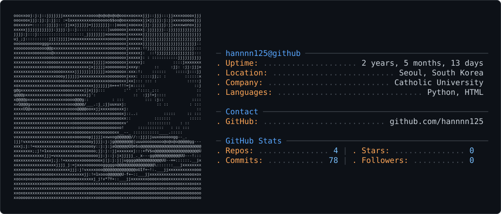

## Hi there 👋 
---
🌱 I’m currently learning Artificial Intelligence
 - AI Agent
 - Information Retrieval
 - Conversational AI
 - Multimodal learning

     

---

  <pre align="center">
╭─╮╷ ╷╭─╮╭─╮╭─╴╷╶┬╴╶┬╴╷╭╮╷╭─╴
│ ││╭╯╶─┤├─╮├╴ │ │  │ ││╰┤│╶╮
╰─╯╰╯ ╰─╯╰─╯╵  ╵ ╵  ╵ ╵╵ ╵╰─╯
  </pre>

---
  <source media="(prefers-color-scheme: dark)" srcset="dark_mode.svg" />
  <source media="(prefers-color-scheme: light)" srcset="light_mode.svg" />
  

---
### 💻 Skills

   
   
  

    

 
 Now learning:
    

--- 

### 🌱 Blog Posting

- [[Github] 깃허브 프로필 꾸미기 A to Z](https://mo0nh7.tistory.com/32)
- [[Stanford CS224N] Lecture 7 Attention](https://mo0nh7.tistory.com/31)
- [[Stanford CS224N] Lecture 6 LSTM RNNs and Neural Machine Translation](https://mo0nh7.tistory.com/30)

